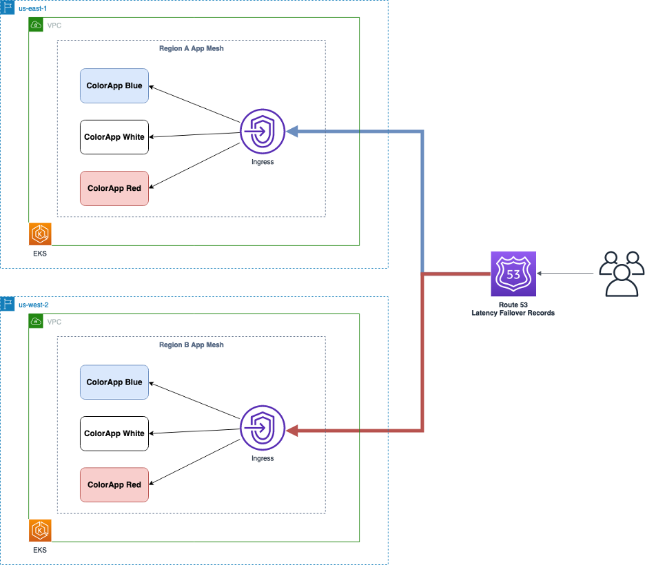
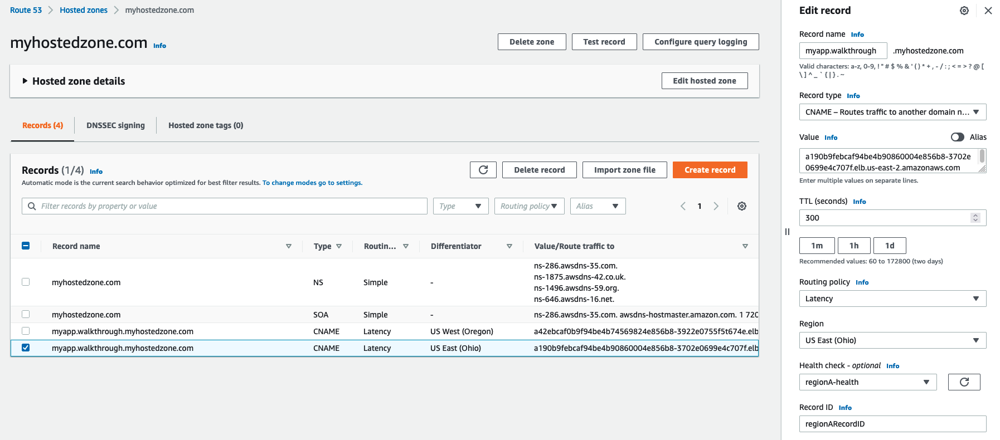

# Overview

In this walkthrough, we are going to show how to leverage AWS App Mesh and Amazon Route53 capabilities to run an active-active, multi-region, highly available application on AWS. AWS App Mesh will allow access to multiple applications within one EKS cluster using a single ingress gateway. We will also use Route 53 Latency records to ensure high-availability and regional failover.

We will use two EKS clusters in different regions and both clusters will have aws app mesh controller installed. We will configure an Ingress Gateway in our existing example color app but with a VirtualGateway resource instead of VirtualNode for ingress traffic.

A virtual gateway allows resources outside your mesh to communicate to resources that are inside your mesh. The virtual gateway represents an Envoy proxy running in an Amazon ECS, in an Amazon EKS, or on an Amazon EC2 instance. Unlike a virtual node, which represents a proxy running with an application, a virtual gateway represents the proxy deployed by itself.

# Architecture



## Prerequisites

Before you get started with the walkthrough, you will need the following:

1. An [AWS Account ID](https://aws.amazon.com/premiumsupport/knowledge-center/create-and-activate-aws-account/)

2. The [AWS CLI](https://aws.amazon.com/cli/) installed and configured for use in your development environment.

3. A Docker development environment and familiarity with using Docker.

4. kubectl [installed](https://kubernetes.io/docs/tasks/tools/), at least version 1.19 or above

5. eksctl [installed](https://docs.aws.amazon.com/eks/latest/userguide/eksctl.html) and configured for use.

6. Helm [installed](https://docs.aws.amazon.com/eks/latest/userguide/helm.html) and configured for use.

7. jq [installed](https://stedolan.github.io/jq/download/)

8. Registered public domain to create route53 hosted zone

## Setup - Region A

1. Clone this repository and navigate to the walkthrough/howto-k8s-multi-region folder, all commands will be ran from this location

```
git clone https://github.com/aws/aws-app-mesh-examples.git
cd aws-app-mesh-examples
cd walkthroughs/howto-k8s-multi-region
```

2. The EKS cluster is provisioned by executing the script **eks-multi-region-eksCluster.sh**. We will configure some environment variables and provide executable permissions to the script before we invoke it. In the following set of commands, replace `us-east-2` with your preferred AWS region and `clusterA` with your preferred cluster name and execute it. Please note that this process can take 20-25 minutes. 

```
chmod +x eks-multi-region-*.sh

export AWS_ACCOUNT_ID=$(aws sts get-caller-identity --output text --query 'Account')
export AWS_REGION='us-east-2'
export CLUSTER_NAME='clusterA'
export ENVOY_IMAGE_REPO='public.ecr.aws/appmesh/aws-appmesh-envoy'
export ENVOY_IMAGE_TAG='v1.22.0.0-prod'

./eks-multi-region-eksCluster.sh

```

3. Ensure kubectl is pointing to the correct cluster by running the folllwing command

```
export KUBECONFIG=~/.kube/eksctl/clusters/$CLUSTER_NAME
kubectl config current-context
kubectl get nodes
```

4. Execute the **eks-multi-region-appMeshController.sh** script to create the appmesh-system namespace, IAM service account. This script will also install the appmesh-controller helm chart in the EKS cluster that was created in the previous step.

```
./eks-multi-region-appMeshController.sh
```

5. Invoke the deployment script to build the color app image locally, push it to Amazon ECR, and deploy the mesh and application to your cluster.
```
./eks-multi-region-deploy.sh
```

6. Now let’s test the application. You can use curl or access the endpoint of your Load Balancer in a web browser.

This may take a few minutes to become fully available. Note you can either include the color in the header, or use the path-based functionality.

There are two GatewayRoutes setup in this example:

1) `gateway-route-headers` 
2) `gateway-route-paths`

`gateway-route-headers` will route traffic to VirtualService `color-headers` and `gateway-route-paths` will route traffic to VirtualService `color-paths`

VirtualService `color-headers` uses a VirtualRouter to match HTTP headers to choose the backend VirtualNode. VirtualService `color-paths` uses HTTP path prefixes to choose backend VirtualNode.

Run the folllwing command to get the Gateway URL

```
export GW_ENDPOINT=$(kubectl get svc ingress-gw -n howto-k8s-multi-region --output jsonpath='{.status.loadBalancer.ingress[0].hostname}')
```
Test the application using HTTP Path
```
curl http://$GW_ENDPOINT/paths/red 
{"Color": "red", "Location": "us-east-2b"}

curl http://$GW_ENDPOINT/paths/white
{"Color": "white", "Location": "us-east-2b"}
```

Test the application using HTTP Headers
```
curl -H "color_header: red" http://$GW_ENDPOINT/headers
{"Color": "red", "Location": "us-east-2b"}

curl -H "color_header: blue" http://$GW_ENDPOINT/headers
{"Color": "blue", "Location": "us-east-2b"}
```

The endpoint returns the requested color along with the region and availability zone of the node this application pod is running in.

## Setup - Region B

Now that the setup for the first region is done, we will replicate this entire setup in Region 2 (us-west-2). Run the following commands. Replace `us-west-2` with your preferred AWS region and `clusterB` with your preferred cluster name.

```
export AWS_REGION='us-west-2'
export CLUSTER_NAME='clusterB'

./eks-multi-region-eksCluster.sh
```

Repeat all the steps starting from Step 3 to Step 6.
 
Now that we have our application running in both regions, let’s setup Amazon Route53 to enable High Availability and automatic failover capabilities.

## Route 53 Setup

6. Create Route 53 Hosted Zone and Domain Health Checks

Amazon Route 53 health checks monitor the health and performance of your web applications, web servers, and other resources. You can create a health check that monitors whether Route 53 considers other health checks healthy or unhealthy. One situation where this might be useful is when you have multiple resources that perform the same function, such as multiple web servers, and your chief concern is whether some minimum number of your resources are healthy. You can create a health check for each resource without configuring notifications for those health checks. Then you can create a health check that monitors the status of the other health checks and that notifies you only when the number of available web resources drops below a specified threshold.
 
Since the AppMesh Ingress gateway allows us to access the different color sub-applications, we will setup Route53 health checks for each color using its endpoint, and then a combined health check to monitor the sub-health checks.

Please note you need registered public domain to successfully create the route53 public hosted zone and test the automated regional failover.

The `eks-multi-region-configureRoute53.sh` script will create the required hosted zone and health checks. Please note if you already have a hosted zone in Route 53, you can pass in the hosted zone Id as a parameter to the script. If you don’t provide a hosted zone Id the script will create the hosted zone for you. 

Assuming that the AWS region for region A is us-east-2, AWS region for region B is us-west-2, cluster name for region A is clusterA, cluster name for region B is clusterB, myhostedzone.com as the domain name and myapp.walkthrough as the sub domain name, the script can be executed using the following command
```
./eks-multi-region-configureRoute53.sh us-east-2 us-west-2 clusterA clusterB myhostedzone.com myapp.walkthrough
```

After the script executes successfully, when you review AWS console then route 53 hosted zone and health checks will look like the following




At the end of this step, you should have the following Route 53 health checks.

| Load Balancer Region | Health Check Name | Path |
| --- | --- | --- |
| RegionA (us-east-2) | regionA-white | /paths/white |
| RegionA (us-east-2) | regionA-red | /paths/red |
| RegionA (us-east-2) | regionA-blue | /paths/blue |
| RegionB (us-west-2) | regionB-white | /paths/white |
| RegionB (us-west-2) | regionB-red | /paths/red |
| RegionB (us-west-2) | regionB-blue | /paths/blue |
| RegionA (us-east-2) | regionA-health | Combined health check of all region A health checks |
| RegionA (us-west-2) | regionB-health | Combined health check of all region B health checks |

The route53 hosted zone will also have latency record sets created for both the regions.

With latency-based routing, Amazon Route 53 can direct your users to the lowest-latency AWS endpoint available. The Route 53 DNS servers decide, based on network conditions of the past couple of weeks, which Load Balancer endpoint should serve users from which region. 
 
To test this, we will launch an EC2 instance in both regions, and invoke the Route53 record from those instances. 

Create a Cloud Formation stack using the template `ec2_cfn.yaml` included in the GitHub repository. This template will launch EC2 instances along with the required security groups in both regions. The template takes an existing KeyPair name as a parameter to allow SSH access to the hosts.

Execute the following command to create ec2 instances in both regions. Please change parameter value of `KeyPairName` parameter to a valid value before executing the command.

```
aws --region us-east-2 cloudformation create-stack --stack-name test-ec2-stack --template-body file://ec2_cfn.yaml --parameters ParameterKey=KeyPairName,ParameterValue=test-key-pair

aws --region us-west-2 cloudformation create-stack --stack-name test-ec2-stack --template-body file://ec2_cfn.yaml --parameters ParameterKey=KeyPairName,ParameterValue=test-key-pair
```

Connect to the ec2 instances using SSH and test the application using curl.

```
RegionA EC2 Instance

$ curl http://myapp.walkthrough.myhostedzone.com/paths/white
{"Color": "white", "Location": "us-east-2f"}

RegionB EC2 Instance
 
$ curl http://myapp.walkthrough.myhostedzone.com/paths/white
{"Color": "white", "Location": "us-west-2a"}
```

7. Simulate Failover

We will now simulate a failover scenario wherein one of the sub-applications in RegionB will fail to respond. 
 
Ensure that kubectl config is pointed towards the EKS cluster in RegionB.

```
kubectl config get-contexts
```

Run this command to delete the deployment for the “white” sub-application.

```
kubectl delete Deployment white -n howto-k8s-multi-region
deployment.apps "white" deleted
```

You can confirm that the Deployment and all its pods for the white sub-application have been terminated.

```
kubectl get all -n howto-k8s-multi-region
```

Now that the white sub-application in Region B has been deleted, the regionB-white health check should turn unhealthy, which should cause the cumulative regionB-health health check to turn unhealthy as well.


8. Verify Failover

Since our application in Region B is currently down, all traffic going to our DNS record should be redirected to the application in Region A. We will confirm that by accessing the application from the EC2 Instance in Region B.

```
RegionB EC2 Instance
 
$ curl http://myapp.walkthrough.myhostedzone.com/paths/white
{"Color": "white", "Location": "us-east-2f"}
```

From the above walkthroughs, you can see that adding a few simple elements to your App Mesh configuration provides robust and secure ingress routing to your application. Additionally, Route53 Latency based Failover records allow us to leverage our AppMesh Ingress endpoints to efficiently run a Highly Available Active-Active application with automatic instant regional failover.

## Cleanup

1. Set the kubectl context for the cluster in each region and delete the resources that were created.

```
export KUBECONFIG=~/.kube/eksctl/clusters/clusterA
kubectl delete -f _output/manifest.yaml

export KUBECONFIG=~/.kube/eksctl/clusters/clusterB
kubectl delete -f _output/manifest.yaml
```

2. Delete the clusters in the both the regions using eksctl

```
eksctl delete cluster --region=us-east-2 --name=clusterA

eksctl delete cluster --region=us-west-2 --name=clusterB

```

3. Delete the EC2 instances that were launched in both the regions to test the application.

```
aws --region us-east-2 cloudformation delete-stack --stack-name test-ec2-stack

aws --region us-west-2 cloudformation delete-stack --stack-name test-ec2-stack
```

4. Delete the ECR repository `howto-k8s-multi-region/colorapp` in both the regions.

```
aws --region us-east-2 ecr delete-repository --repository-name howto-k8s-multi-region/colorapp --force

aws --region us-west-2 ecr delete-repository --repository-name howto-k8s-multi-region/colorapp --force
```

6. Delete the envoy IAM policies created for clusters in both the regions.

```
aws iam delete-policy --policy-arn arn:aws:iam::$AWS_ACCOUNT_ID:policy/clusterA-us-east-2-AWSAppMeshK8sEnvoyIAMPolicy

aws iam delete-policy --policy-arn arn:aws:iam::$AWS_ACCOUNT_ID:policy/clusterB-us-west-2-AWSAppMeshK8sEnvoyIAMPolicy
```

7. Go to Route53 console and delete the health checks created as part of the walkthrough for both the regions.

8. Delete the CNAME records created in the public hosted zone as part of the walkthrough.

9. If the Route 53 hosted zone was created by this walkthrough, then delete it. 

# Conclusion

From this walkthrough, you can see that making use of App Mesh virtual Service, virtual nodes, virtual routers and gateway routes provides robust and secure ingress routing to your application. Additionally, Route53 Latency based Failover records allow us to leverage our AppMesh Ingress endpoints to efficiently run a Highly Available Active-Active application with automatic instant regional failover.

These examples are fairly basic and we hope that you use them as a starting point for your own solutions. Be sure to check out the [AWS App Mesh documentation](https://docs.aws.amazon.com/app-mesh/index.html) and the [Amazon Route53 documentation](https://docs.aws.amazon.com/route53/index.html) for details on working with these services as well as detailed sections on Getting Started, Best Practices, and Troubleshooting.

You can let us know what you think of this feature, review our roadmaps, and suggest new features on the [AWS App Mesh Roadmap](https://github.com/aws/aws-app-mesh-roadmap) and the [AWS Containers Roadmap](https://github.com/aws/containers-roadmap), also hosted on GitHub.
